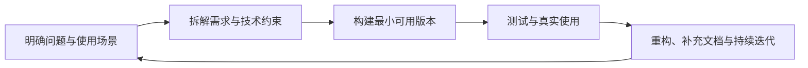

# 你好，我是 Jeoitim 👋

**独立开发者 · 技术爱好者 · Python / Node.js 实践者**

我是一名以项目实践为主的独立开发者，主要使用 Python 和 Node.js 构建本地工具、Web 应用与自动化系统。  
我会借助 AI 加速探索和实现，同时关注代码的可维护性、可验证性，以及项目真正落地后的使用体验。

  
  

---

## 关于我

- 主要使用 **Python** 与 **Node.js**，并持续拓展 TypeScript、React 和现代 Web 工具链
- 关注本地优先的工具、数据处理、音视频应用、教育场景和个人效率
- 喜欢把一个具体问题拆解成可验证、可迭代的工程方案
- 使用 AI 辅助完成资料整理、原型开发、代码重构和文档维护
- 重视从“能运行”继续推进到“可复现、可维护、可交付”
- 在[个人博客](https://www.timhut.qzz.io/)记录项目实践、技术思考和开发过程

## 我的开发方式

> 先理解问题，再构建最小可用版本；用真实使用反馈推动下一轮迭代。

## 代表项目

| 项目 | 项目简介 | 技术与特点 |
| --- | --- | --- |
| **[GRECIS](https://github.com/Jeoitim/GRECIS)** | 面向考研英语阅读的本地语料分析与精读系统。统一管理考研真题、外刊文章和本地授权语料，围绕文章质量、词汇分级、熟词生义、固定表达与句式模式建立结构化分析流程，并支持 Markdown、Anki 和红宝书式资料导出。 | Python、SQLite、本地 NLP、可选 LLM 分析、Web 精读台 |
| **[Spectro Pro](https://github.com/Jeoitim/spectro-pro)** | 面向语音观察与教学场景的浏览器声学可视化工具。支持麦克风和本地音频输入，提供波形、宽带与窄带语谱图、F0、共振峰及音强分析，并通过 Web Worker 与 WebGL 实现实时交互式可视化。 | TypeScript、WebAudio、FFT、WebGL、GitHub Pages / Cloudflare Pages |
| **[Fast Embed Sub](https://github.com/Jeoitim/fast-embed-sub)** | 轻量、跨平台的视频字幕压制工具。通过拖拽操作、字幕自动关联和任务队列降低视频处理门槛，同时提供数据驱动的压制预设系统与隔离式 VapourSynth 后处理环境，兼顾普通用户体验和高级调参需求。 | Python、PySide6、FFmpeg、VapourSynth、桌面应用 |
| **个人博客** | 记录项目实践、技术探索、学习过程与开发中的问题复盘。博客基于 [NotionNext](https://github.com/tangly1024/NotionNext) 构建，感谢 NotionNext 提供的优秀开源博客框架。 | [访问 timhut.qzz.io](https://www.timhut.qzz.io/) |

## 技术栈

| 方向 | 技术 |
| --- | --- |
| **语言与运行时** | Python、JavaScript、TypeScript、Node.js |
| **前端与全栈** | React、Vue、Vite、Next.js |
| **部署与工程** | Docker、Vercel、Cloudflare、Git、GitHub |
| **数据存储** | SQLite、MySQL、MongoDB |
| **工程实践** | REST API、自动化脚本、测试、文档、AI 辅助开发 |

  

## 目前关注的方向

- **工具产品化**：把个人需求和开发过程中的重复工作沉淀成可复用工具
- **Python / Node.js 全栈实践**：从数据处理、后端服务到交互界面和部署流程
- **AI 辅助工程**：探索 AI 在需求分析、代码实现、测试、重构和文档维护中的实际价值
- **本地优先应用**：关注隐私、可控性和离线环境下的使用体验
- **持续迭代**：通过真实使用、问题复盘和小步重构，让项目逐渐接近稳定产品

## 一些说明

我目前仍处于持续积累和扩展技术边界的阶段，但会认真对待每一个实际项目：  
从需求、架构和实现，到测试、文档、部署与后续维护，尽量让项目不仅能够运行，也能够被理解、复现和继续演进。

如果你也关注独立开发、AI 辅助编程、Python / Node.js 工具链，或者正在做类似的小型项目，欢迎通过 GitHub 或[个人博客](https://www.timhut.qzz.io/)交流。

**保持好奇，持续构建，让想法逐渐成为作品。**

个人主页 README · 持续更新中

---

  
  

