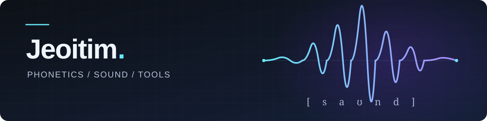

# 你好，我是 Jeoitim 👋

**语音学，以及一些日常用得上的小工具。**

[个人博客](https://www.timhut.qzz.io/) · [语音学项目](#语音学项目) · [实用工具](#实用工具)

我对语音学感兴趣，喜欢探索发音的构形和声音的变化。这里放着我围绕这些兴趣做的项目，也有一些整理笔记、处理音视频时用得上的工具。

## 语音学项目

| 项目 | 可以用来做什么 | 入口 |
| --- | --- | --- |
| **Articulatory Phonetics Explorer** | 选择 IPA 音标，观察舌位、唇形与气流，探索和对比不同的调音构形。 | [在线体验](https://jeoitim.github.io/articulatory-phonetics-explorer/) · [仓库](https://github.com/Jeoitim/articulatory-phonetics-explorer) |
| **Spectro Pro** | 用麦克风或本地音频实时查看波形、语谱、基频与共振峰，让声音的变化更直观。 | [在线体验](https://jeoitim.github.io/spectro-pro/) · [仓库](https://github.com/Jeoitim/spectro-pro) |
| **Praat 中文修改版** | 面向习惯中文界面的 Praat 用户，提供汉化界面、帮助手册和增强脚本，方便标注与分析语音材料。 | [下载](https://github.com/Jeoitim/praat-chinese-modified/releases) · [仓库](https://github.com/Jeoitim/praat-chinese-modified/tree/jeoitim-modified) |

调音探索与实时语谱主要用于学习、观察和教学；项目的使用范围与说明见各自仓库。

## 实用工具

### [markmap++](https://github.com/Jeoitim/markmap-pp)

把 Markdown 笔记变成可以展开、折叠的思维导图。支持边写边看、直接编辑导图节点、导出图片和文档，也可以通过 GitHub 在不同设备之间继续整理笔记。

[在线使用](https://jeoitim.github.io/markmap-pp/) · [项目仓库](https://github.com/Jeoitim/markmap-pp)

### [Fast Embed Sub](https://github.com/Jeoitim/fast-embed-sub)

一个视频字幕压制工具。拖入视频和字幕，选择预设，就可以把字幕嵌入视频；支持同名字幕自动关联和多个任务排队处理。

[项目仓库与使用说明](https://github.com/Jeoitim/fast-embed-sub)

此外还会放一些出于个人爱好、解决日常需求的实用脚本和小项目。

## 博客与交流

在[个人博客](https://www.timhut.qzz.io/)里记录学习、使用工具和折腾这些项目的过程。如果你也对语音学、笔记整理或音视频工具感兴趣，欢迎交流。

